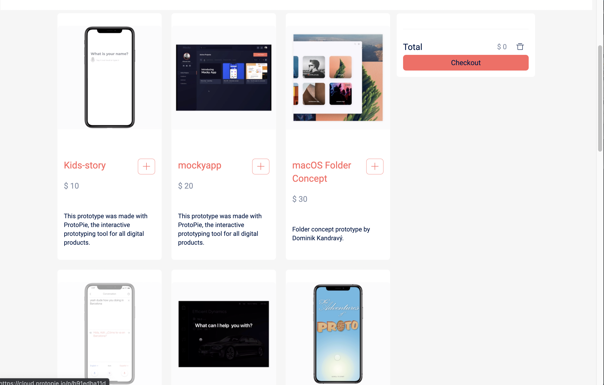
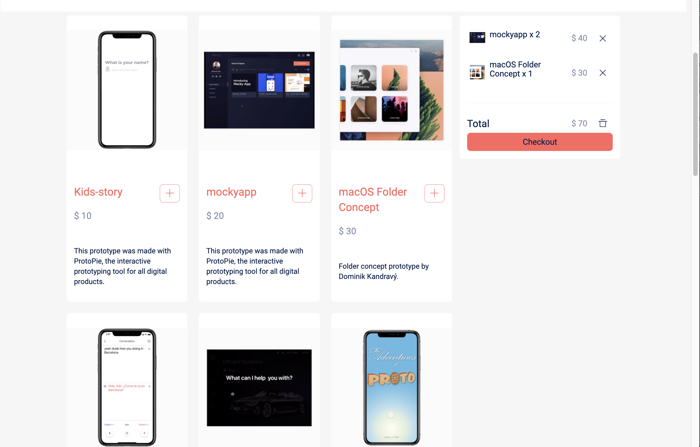

# ShoppingMallSite

- 앱 설명
  - 상품 판매가 가능한 쇼핑몰 사이트 개발
- 사용 Skills
  - JavaScript, React, Redux
- 기능 구현
  - 상품 목록을 생성, 상품을 추가 및 수정, 장바구니 기능 구현
- 성장한 부분
  - Context API와 Hooks를 이용한 전역 상태 관리 학습

< Main UI >

< 장바구니에 추가된 상품 UI >

